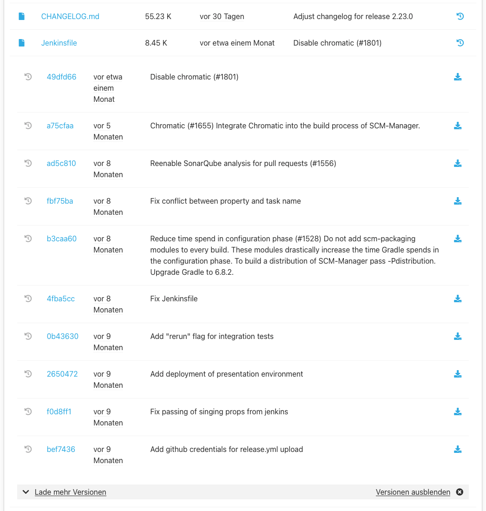

Diese Dokumentation beschreibt die Verwendung vom scm-history-download-plugin. Sie steht in verschiedenen Sprachen und Versionen zur Verfügung, die im Menü rechts ausgewählt werden können.

Das History Download Plugin bietet die Möglichkeit, ältere Versionen einer Datei direkt vom Dateibaum herunterzuladen.
Dazu kann man auf das Historie Symbol neben einer Datei im Dateibaum klicken.
Daraufhin werden die ersten 10 Versionen der Datei geladen.
Eine Version wird immer mit folgenden Informationen angezeigt:

* Dem Link zum Commit/Changeset
* Dem Änderungsdatum
* Der Commit/Changeset Beschreibung
* Dem Download Symbol

Mit einem Klick auf das Download Symbol wird die Datei in der ausgewählten Version heruntergeladen.

Gibt es mehr als 10 Versionen können die nächsten 10 über den "Lade mehr Versionen" Link geladen werden.
Wird das Historie Symbol einer anderen Datei angeklickt, 
so wird die Versions Übersicht der vorherigen Datei geschlossen und die der angeklickten Datei angezeigt.
Wenn das Historie Symbol erneut oder der "Versionen ausblenden" Link angeklickt wird, 
wird die Versions Übersicht geschlossen.
