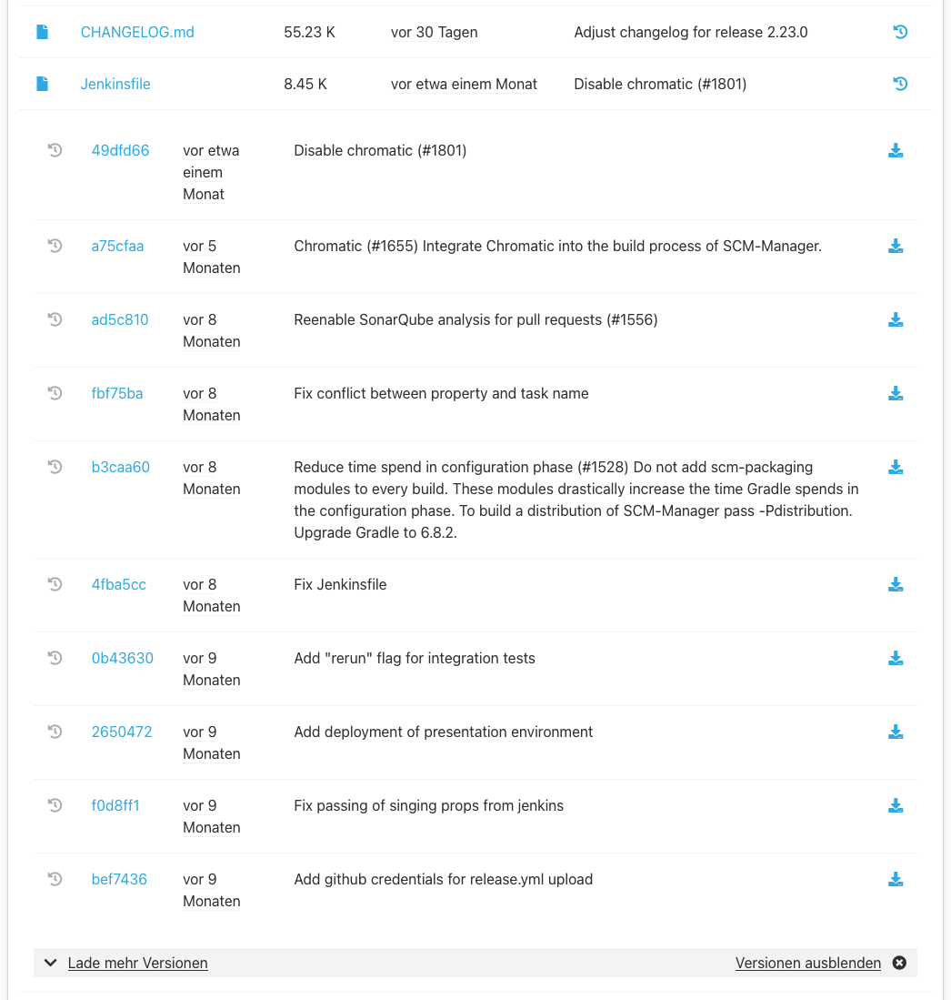

Diese Dokumentation beschreibt die Verwendung des scm-history-download-plugins. Sie steht in verschiedenen Sprachen und Versionen zur Verfügung, die im Menü rechts ausgewählt werden können.

Das History-Download-Plugin bietet die Möglichkeit, ältere Versionen einer Datei direkt vom Dateibaum aus herunterzuladen.
Dazu kann man auf das Historien-Symbol neben einer Datei im Dateibaum klicken.
Daraufhin werden die jüngsten zehn Versionen der Datei geladen.
Eine Version wird immer mit den folgenden Informationen angezeigt:

* Dem Link zum Commit/Changeset,
* dem Änderungsdatum,
* der Commit/Changeset-Beschreibung,
* dem Download-Symbol.

Mit einem Klick auf das Download-Symbol wird die Datei in der ausgewählten Version heruntergeladen.

Gibt es mehr als zehn Versionen können die nächsten zehn über den „Lade mehr Versionen“-Link geladen werden.
Wird das Historien-Symbol einer anderen Datei angeklickt, 
so wird die Versionsübersicht der vorherigen Datei geschlossen und die der angeklickten Datei geöffnet.
Wenn erneut das Historien-Symbol oder der „Versionen ausblenden“-Link angeklickt wird, 
schließt sich die Versionsübersicht.
