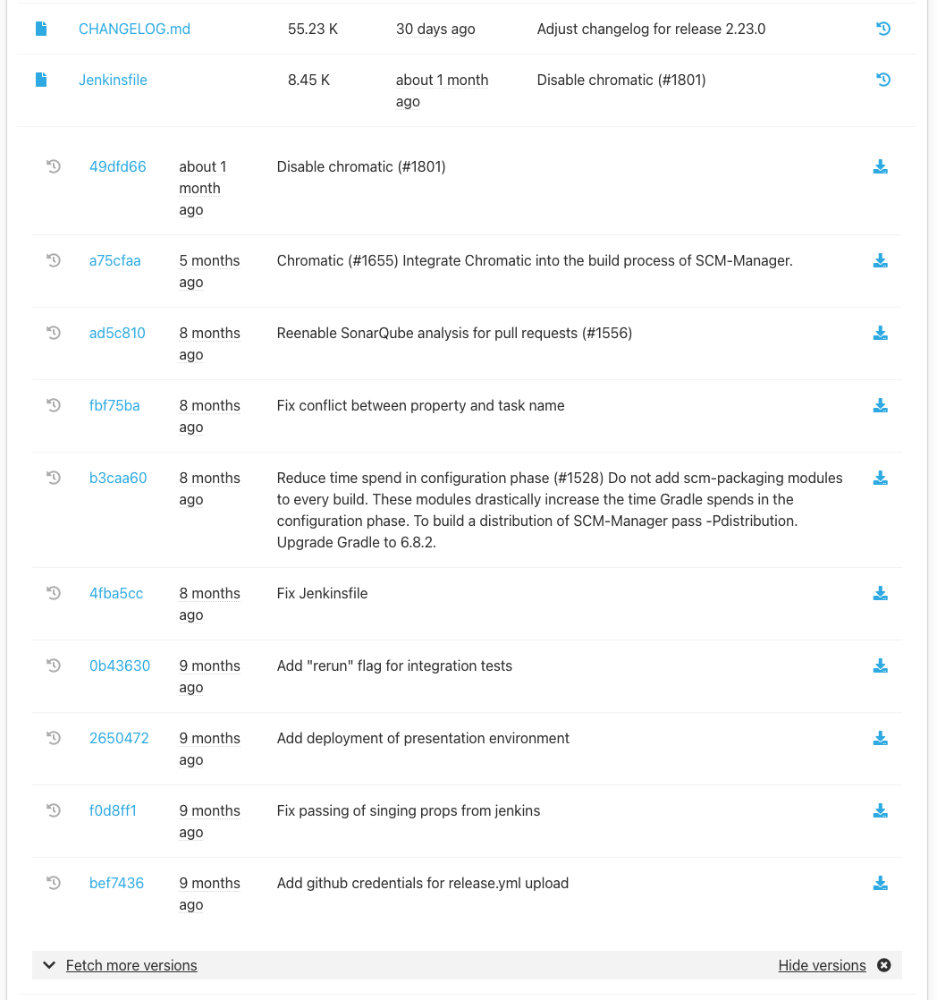

This documentation describes the usage of the scm-history-download-plugin. It is available in different languages and versions, which can be selected from the menu on the right.

The History Download Plugin offers the possibility to download older versions of a file directly from the file tree.
To do this, click on the history icon next to a file in the file tree.
The 10 most recent versions of the file will be loaded.
A version is always displayed with the following information:

* The link to the commit/changeset
* The modification date
* The commit/changeset description
* The download icon

With a click on the download icon the file will be downloaded in the selected version.

If there are more than 10 versions, the next 10 can be loaded via the "Fetch more versions" link.
If the history symbol of another file is clicked, 
the version overview of the previous file is closed and the one of the clicked file is opened.
If the history icon is clicked again or the "Hide versions" link is clicked, 
the versions overview will be closed.
